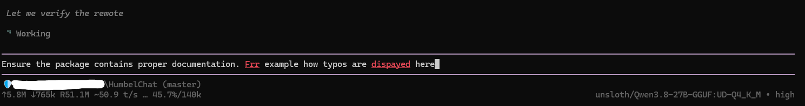
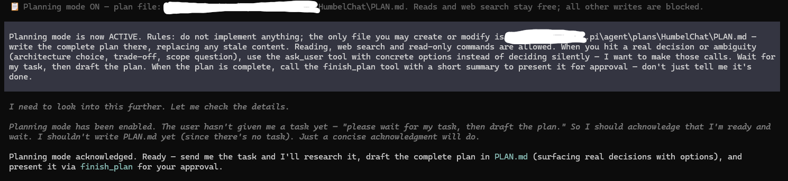
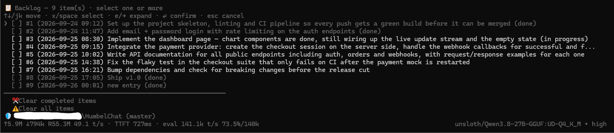
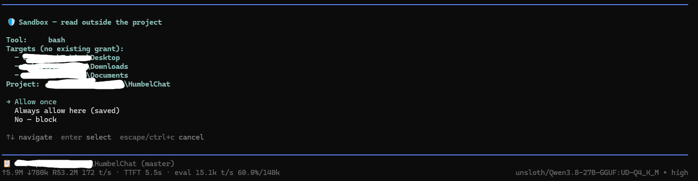
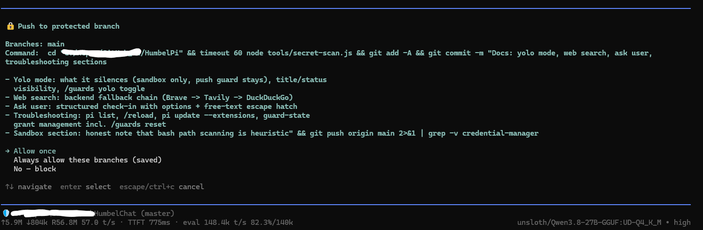
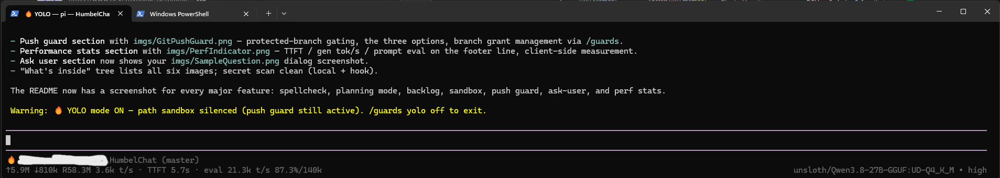
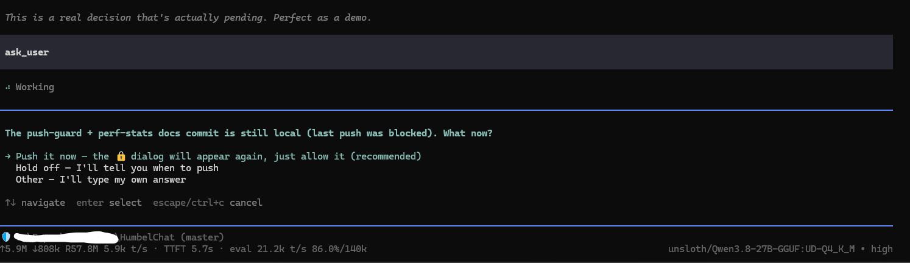

# HumbelPi

Personal [pi coding agent](https://github.com/badlogic/pi-mono) setup, distributed as a
[pi package](https://github.com/badlogic/pi-mono/blob/main/packages/coding-agent/docs/packages.md).
Everything here is **extensions** — the pi installation itself is never modified.

## What's inside

```
extensions/
  guards.ts        sandbox + git-push guard, yolo mode, planning mode (/plan on [task]),
                   per-group permission dialogs, custom footer (perf stats), title sync
  backlog.ts       /backlog checklist: multi-select + actions (plan/implement/done/delete/clear)
  perf-stats.ts    tok/s + TTFT measured client-side, shown in the footer
  working-task.ts  working_task tool — model sets/clears the current task in the working indicator
  spellcheck.ts    spelling checks for user messages (dictionary: extensions/words-en.txt)
  web-search.ts    web search tool
  ask-user.ts      structured ask_user dialog
imgs/                screenshots used in the sections below
  SpellCheck.png         spellcheck highlighting
  Planning_Mode.png      planning mode
  Backlog.png            /backlog checklist
  Guards_FileAccess.png  sandbox file-access dialog
  GitPushGuard.png       push-guard dialog
  YoloMode.png           yolo mode (title + status)
  PerfIndicator.png      perf stats in the footer
  SampleQuestion.png     ask_user dialog
.githooks/pre-push   secret scan that runs on every push (this repo is public)
```

## Spellcheck

`spellcheck.ts` replaces pi's editor with a subclass that highlights likely typos
**live, in place, while you type** — red + underlined, like a web form. No prompts,
no post-enter confirmation: the text is sent exactly as typed.



- Dictionary: `extensions/words-en.txt` (~370k words, bundled); personal additions go
  to `~/.pi/agent/spell-ignore.txt` (one word per line — names, identifiers, project terms).
- Skipped: slash commands, CamelCase / ALLCAPS tokens, words with digits or symbols,
  words ≤ 2 letters.
- Toggle: `/spellcheck on | off | status`.

## Planning mode



- Enter with `/plan on [task]` — one step: opens planning mode and hands the task
  over as the plan's starting point.
- While active, only the plan file is writable: `~/.pi/agent/plans/<project>/PLAN.md`;
  reads and searches stay free.
- The finished plan is presented via the **finish_plan** dialog — "✅ Approve & implement"
  starts implementation immediately; "✏️ Keep planning" asks for a short refusal reason
  that is fed back to the agent.
- Planning state also syncs into the window title, so it's visible at a glance.

## Backlog



- Bare `/backlog` opens the project's task list (`.pi/backlog.md`) as a multi-select
  checklist; `/backlog <idea>` appends a new item.
- Navigate with ↑↓ / `j` `k`, toggle items with `x` or space, ⏎ confirms the selection,
  esc cancels. Long items expand inline with `e` or → (word-wrapped full text);
  several can be open at once.
- After confirming, pick an action for the selected items: **plan** (hands them to
  planning mode), **implement**, **mark done**, or **delete** — plus bottom rows for
  clearing completed / all entries.
- Status markers per item: `[ ]` open, `[~]` in progress, `[x]` done (rendered dimmed).

## Sandbox — file access outside the project



- Any tool call touching a path **outside the project** is gated by this dialog before
  it runs.
- The dialog shows: tool name, target(s) with their current setting (`no grant` /
  `read-only — writes ask`), the project root, and a consequence note where relevant.
- Options depend on the request and existing grants:
  - read, no grant: `Allow once` · `Always allow here (saved)` · `No — block`
  - write, no grant: adds `Read-only here (writes still ask, saved)`
  - write into a read-only area: `Allow this write once` · `Upgrade to full access (saved)`
    · `Keep read-only — block this write`
- Saved options persist per machine in `~/.pi/agent/guard-state.json`; "Allow once" is
  one-shot; blocking aborts the tool call immediately.
- Honest limitation: bash commands are scanned *heuristically* for the paths they
  touch — the sandbox is a guardrail, not a hard boundary.

## Push guard



- `git push` landing on a protected branch (`main` / `master`) is gated by this dialog;
  feature branches pass silently.
- Options: `Allow once` · `Always allow these branches (saved)` · `No — block`. Saved
  branches persist in `~/.pi/agent/guard-state.json`; manage them with
  `/guards allow-branch <name>` / `/guards revoke-branch <name>`.

## Yolo mode



- 🔥 YOLO mode silences the path sandbox — tool calls no longer ask about paths
  outside the project. The **push guard stays active**.
- The state is visible at all times in the window title (`🔥 YOLO — pi — <dir>`) and
  in the `/guards` status line, so you always know it's on.
- Toggle: `/guards yolo on | off`.

## Web search

- Registers a `web_search` tool in every project.
- Backends are tried in order: `BRAVE_API_KEY` (Brave Search API) →
  `TAVILY_API_KEY` (Tavily) → DuckDuckGo HTML (no key required).
- For full page content after a search, the agent just curls the URL.

## Ask user



- The `ask_user` tool lets the agent check in before making an important assumption:
  it presents a list of concrete options plus a free-text "Other" escape hatch. Your
  answer comes back as the tool result and the agent proceeds with exactly that.

## Performance stats


- Per-LLM-call stats on the footer's model info line — no extra console lines.
- **TTFT**: request → first content delta; **gen tok/s**: output tokens / streaming
  time (live estimate while streaming); **prompt eval**: blended prefill speed, shown
  when possible.
- Measured client-side from pi's events — providers don't report server-side timing.

## New machine setup

```bash
# 1. pi itself (pristine, unmodified)
npm i -g @earendil-works/pi-coding-agent

# 2. this package
pi install git:github.com/MeleeCampz/HumbelPi
```

## Development on a machine that uses this repo directly

Install with a local path instead of git — pi loads the extensions in place, so
editing a file here and restarting pi is the whole dev loop:

```bash
pi install ./path/to/HumbelPi
```

The `pre-push` hook (`.githooks/pre-push`, enabled per clone via
git config core.hooksPath .githooks) runs tools/secret-scan.js on every push:
API keys, non-placeholder apiKey values, PEM private keys, Bearer tokens,
user-specific paths. It aborts the push if anything looks private.

## Troubleshooting

- `pi list` — shows installed packages and where they resolve to.
- `/reload` — reload extensions/settings after manual edits.
- `pi update --extensions` — reconcile package installs (pulls new commits from a git source).
- Grants live in `~/.pi/agent/guard-state.json`. `/guards` shows the full status;
  individual grants are managed with `/guards allow-path|revoke-path|allow-ro-path|
  revoke-ro-path|allow-branch|revoke-branch`, and `/guards reset` clears everything
  and re-enables both guards.
