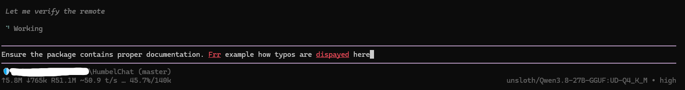
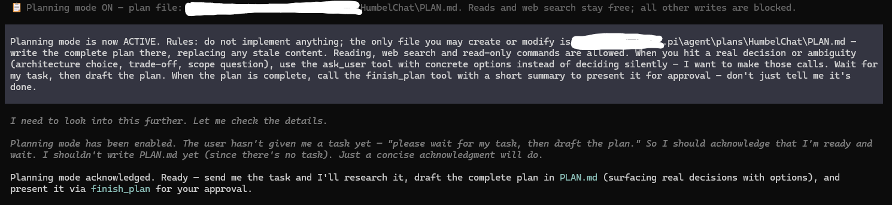
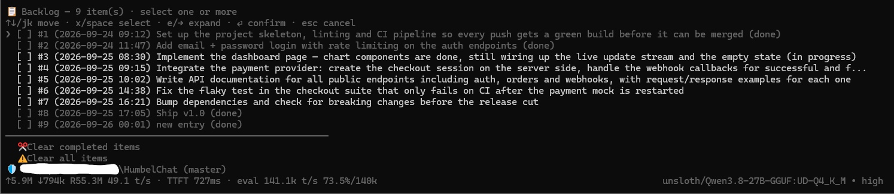
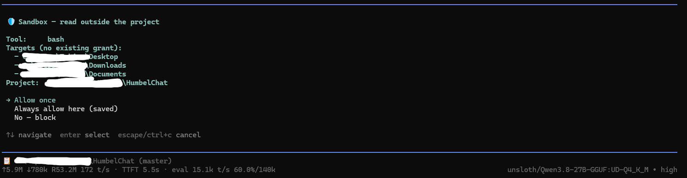
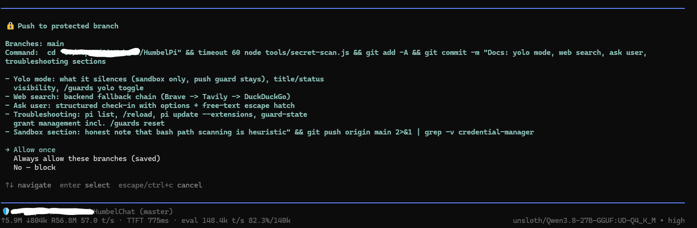
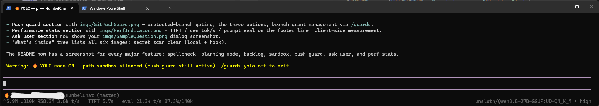
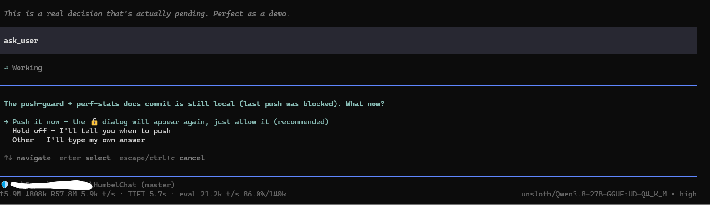
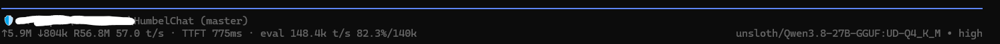

# HumbelPi

Personal [pi coding agent](https://github.com/badlogic/pi-mono) setup, distributed as a
[pi package](https://github.com/badlogic/pi-mono/blob/main/packages/coding-agent/docs/packages.md).
Everything here is **extensions** — the pi installation itself is never modified.

## ⚠️ The guards are not a real sandbox

The path sandbox in `guards.ts` is a **heuristic**. It scans bash commands token by
token and checks tool paths against the project root — it is a guardrail against
accidents, **not a security boundary**.

It can be bypassed, intentionally or not:

- shell variables and expansion (`$HOME`, `$(…)`, backticks), encoded or indirect
  commands, and anything that builds a path at runtime;
- creating a brand-new directory tree *outside* the project (nothing exists yet,
  so there is nothing to detect);
- any tool or code path that isn't inspected token-by-token.

**If you work with untrusted content, very capable models, or unattended runs —
run pi inside a proper sandbox:** a Docker container, a VM, a devcontainer, or at
least strict OS-level user/permissions. The guards then become a second layer of
convenience on top of a real boundary, not the boundary itself.

This repo ships exactly that: [Real sandbox (Docker Sandboxes / sbx)](#real-sandbox-docker-sandboxes-sbx)
— one command, pi running in a microVM with HumbelPi installed inside.

## Real sandbox (Docker Sandboxes / sbx)

[The guards](#-the-guards-are-not-a-real-sandbox) are a guardrail. For a real
boundary, `tools/sbx-pi.sh` runs pi inside a
[Docker Sandboxes](https://docs.docker.com/ai/sandboxes/) **microVM** — one
command from any folder:

```powershell
cd C:\path\to\any\project
sbxpi
```

`sbxpi` is a tiny function in your PowerShell profile (snippet below) that calls
`tools/sbx-pi.sh`, which:

1. Creates a sandbox from Docker's official pi kit (`docker.io/sbx/pi-kit:latest`) —
   or reuses the existing one for this folder (sandboxes are named `pi-<folder>`).
2. Mounts two things into the microVM: your current folder as a **read-write
   workspace**, and this repo **read-only**.
3. Wires your local model: copies the provider from your host's
   `~/.pi/agent/models.json` into the sandbox (baseUrl rewritten to
   `http://host.docker.internal:8888/v1`) and sets it as pi's default model —
   merged into `settings.json`, so installed packages and preferences survive
   re-provisioning. Sandboxes deliberately don't import user-level `~/.pi`
   config, so this step exists.
4. Installs HumbelPi from the read-only mount — guards, backlog, `/away`, perf stats
   and friends run **inside** the VM, as a second layer on top of the real boundary.
5. Drops you into pi's TUI, already on your model — and **continues your last
   session** in that folder (`pi --continue`). With no prior session it simply
   starts fresh; `sbxpi --new` always starts a fresh one.

### One-time setup (per machine)

- Docker Desktop with [Docker Sandboxes](https://docs.docker.com/ai/sandboxes/install/)
  enabled and the `sbx` CLI signed in (`sbx` on PATH or in
  `%LOCALAPPDATA%\DockerSandboxes\bin`).
- A bash and Node.js — on Windows that means Git for Windows (the scripts run
  under its bash; WSL's `System32\bash.exe` won't do, the shims pin Git Bash
  explicitly). On Linux/macOS your existing bash/node are fine.
- **Add `<this repo>\bin` to your PATH** — that's it. The directory contains a
  self-locating `sbxpi` shim per shell family (`sbxpi` for bash-family shells,
  `sbxpi.ps1` for PowerShell, `sbxpi.cmd` for cmd), so the command works in
  **any terminal on any OS** with no per-shell configuration:
  - Windows: *Settings → Environment variables* (or `setx PATH "%PATH%;C:\path\to\HumbelPi\bin"`)
  - Linux/macOS: `export PATH="$PATH:/path/to/HumbelPi/bin"` in your shell rc

  If you can't touch PATH, the fallback is a per-shell wrapper — e.g. a
  PowerShell profile function calling
  `& '<repo>\bin\sbxpi.ps1' @args` — but the PATH entry is the one-size-fits-all
  solution.

### Managing sandboxes

| Command | Effect |
|---|---|
| `sbx ls` | list sandboxes (name, agent, status, workspace) |
| `sbx run --name <n>` | attach to one |
| `sbx stop <n>` | pause, keep the VM (fast restart) |
| `sbx rm <n>` / `sbx rm --force <n…>` | delete — removes the VM and everything in it |
| `sbx prune` | delete all stopped sandboxes |

### How it works / gotchas

- **The workspace is a live read-write mount** — the sandboxed pi edits your real
  files. For isolation from your working tree, create with `sbx create --clone`
  (agent works on a private clone; not yet wired into `sbxpi`).
- **Reaching the local model:** all egress from the microVM is dialed by a proxy on
  the host, and `host.docker.internal` resolves to your machine — so
  `127.0.0.1:8888` (the VM's own loopback) fails while `host.docker.internal:8888`
  reaches llama-server. No extra network-policy rules needed.
- Sandboxes persist until `sbx rm`; re-running `sbxpi` just re-provisions and
  re-attaches (resuming the last session), so model-config changes on the host
  propagate on your next launch. `sbxpi --new` skips the resume.
- Don't launch from your home directory — that mounts your entire profile
  read-write into the VM.
- **Paths above the workspace are VM-local:** the parent directories you see in
  the VM (`/c/...` up the tree) are plain scaffold directories, *not* views of
  your host folders. Anything the agent creates there (stray `AGENTS.md`,
  scratch dirs) lives only inside the VM and dies with it — when the model
  narrates "I can access the parent folder", that is contained.
- **No Anthropic, by design:** Docker's pi kit bakes in egress allows for
  `api.anthropic.com` / `platform.claude.com` and asks interactively whether to
  bind an Anthropic credential when a sandbox is created. Since we run a local
  model, `sbxpi` runs the create with detached stdin so sbx takes the default
  (no binding, no prompt), and adds per-sandbox **deny** rules for both hosts
  (deny outranks the kit's read-only allows). `registry.npmjs.org` stays
  allowed — pi needs it for package installs.

## What's inside

```
extensions/
  guards.ts        sandbox + git-push guard, yolo mode, unattended mode (/away [instruction]),
                   planning mode (/plan on [task]), per-group permission dialogs,
                   custom footer (perf stats), title sync
  backlog.ts       /backlog checklist: multi-select + actions (plan/implement/done/delete/clear)
  perf-stats.ts    tok/s + TTFT measured client-side, shown in the footer
  working-task.ts  working_task tool — model sets/clears the current task in the working indicator
  spellcheck.ts    spelling checks for user messages (dictionary: extensions/words-en.txt)
  web-search.ts    web search tool
  ask-user.ts      structured ask_user dialog
imgs/                screenshots used in the sections below
  SpellCheck.png         spellcheck highlighting
  Planning_Mode.png      planning mode
  Backlog.png            /backlog checklist
  Guards_FileAccess.png  sandbox file-access dialog
  GitPushGuard.png       push-guard dialog
  YoloMode.png           yolo mode (title + status)
  PerfIndicator.png      perf stats in the footer
  SampleQuestion.png     ask_user dialog
.githooks/pre-push   secret scan that runs on every push (this repo is public)
bin/
  sbxpi, .ps1, .cmd  PATH launcher shims — `sbxpi` in any terminal/OS
tools/
  sbx-pi.sh          one-command sandbox launcher — see "Real sandbox" below
  sbx-local-model.sh wires a sandbox's pi to the host's local model
```

## Spellcheck

`spellcheck.ts` replaces pi's editor with a subclass that highlights likely typos
**live, in place, while you type** — red + underlined, like a web form. No prompts,
no post-enter confirmation: the text is sent exactly as typed.



- Works **everywhere you type free text**: the main editor, slash-command arguments
  (e.g. `/backlog <idea>`, `/plan reject [reason]`) and the free-text dialogs — the
  `ask_user` “Other” answer and the plan-feedback input (“✏️ Keep planning”).
- Dictionary: `extensions/words-en.txt` (~370k words, bundled); personal additions go
  to `~/.pi/agent/spell-ignore.txt` (one word per line — names, identifiers, project terms).
- Skipped: slash command names, CamelCase / ALLCAPS tokens, words with digits or symbols,
  words ≤ 2 letters.
- Toggle: `/spellcheck on | off | status`.

## Planning mode



- Enter with `/plan on [task]` — one step: opens planning mode and hands the task
  over as the plan's starting point.
- **Per console**: plan state lives in `~/.pi/agent/session-state/<session>.json`, so
  other pi consoles on the same machine are unaffected; resuming a session keeps its
  plan, new sessions start clean.
- While active, only the plan file is writable: `~/.pi/agent/plans/<project>/PLAN.md`;
  reads and searches stay free.
- The finished plan is presented via the **finish_plan** dialog — "✅ Approve & implement"
  starts implementation immediately; "✏️ Keep planning" asks for a short refusal reason
  that is fed back to the agent.
- Planning state also syncs into the window title, so it's visible at a glance.

## Backlog



- Bare `/backlog` opens the project's task list (`.pi/backlog.md`) as a multi-select
  checklist; `/backlog <idea>` appends a new item.
- Navigate with ↑↓ / `j` `k`, toggle items with `x` or space, ⏎ confirms the selection,
  esc cancels. Long items expand inline with `e` or → (word-wrapped full text);
  several can be open at once.
- After confirming, pick an action for the selected items: **plan** (hands them to
  planning mode), **implement**, **mark done**, or **delete** — plus bottom rows for
  clearing completed / all entries.
- Status markers per item: `[ ]` open, `[~]` in progress, `[x]` done (rendered dimmed).

## Sandbox — file access outside the project



- Any tool call touching a path **outside the project** is gated by this dialog before
  it runs.
- The dialog shows: tool name, target(s) with their current setting (`no grant` /
  `read-only — writes ask`), the project root, and a consequence note where relevant.
- Options depend on the request and existing grants:
  - read, no grant: `Allow once` · `Always allow here (saved)` · `No — block`
  - write, no grant: adds `Read-only here (writes still ask, saved)`
  - write into a read-only area: `Allow this write once` · `Upgrade to full access (saved)`
    · `Keep read-only — block this write`
- Saved options persist per machine in `~/.pi/agent/guard-state.json`; "Allow once" is
  one-shot; blocking aborts the tool call immediately.
- Honest limitation: bash commands are scanned *heuristically* for the paths they
  touch — the sandbox is a guardrail, not a hard boundary. See
  [⚠️ The guards are not a real sandbox](#-the-guards-are-not-a-real-sandbox) —
  for real isolation, use the [Docker Sandboxes setup below](#real-sandbox-docker-sandboxes-sbx).

## Push guard



- `git push` landing on a protected branch (`main` / `master`) is gated by this dialog;
  feature branches pass silently.
- Options: `Allow once` · `Always allow these branches (saved)` · `No — block`. Saved
  branches persist in `~/.pi/agent/guard-state.json`; manage them with
  `/guards allow-branch <name>` / `/guards revoke-branch <name>`.

## Yolo mode



- 🔥 YOLO mode silences the path sandbox — tool calls no longer ask about paths
  outside the project. The **push guard stays active**. Like planning and unattended
  mode, it is **per console**: state lives in `~/.pi/agent/session-state/<session>.json`,
  so other pi consoles on the same machine keep asking.
- The state is visible at all times in the window title (`🔥 YOLO — pi — <dir>`) and
  in the `/guards` status line, so you always know it's on.
- Toggle: `/guards yolo on | off`.

## Unattended mode

- For when you step away and want the agent to keep working: `/away [instruction]`
  turns unattended mode on and immediately hands your instruction to the agent as its
  next message. If a run is already active, the instruction **steers** that run —
  delivered before the agent's next LLM call so it can redirect immediately instead
  of finishing the old task first. Bare `/away` turns it off.
- While on, **every confirmation dialogue is auto-rejected instead of hanging**: the
  sandbox path dialog, the push guard, `ask_user`, and the `finish_plan` approval all
  decline automatically, and each rejection tells the model to pick the safest reasonable
  option and record it in a "Decisions made while unattended" section of its final report.
- Every user message also carries an `[UNATTENDED MODE]` frame so the model knows you are
  away and should not wait for input — when it runs out of safe work it ends its turn
  with a summary instead of blocking.
- **Per console**: unattended state lives in `~/.pi/agent/session-state/<session>.json`,
  so other pi consoles on the same machine are unaffected; resuming the same session
  keeps it, new sessions start clean. YOLO silencing still wins — ops yolo already
  silences never reach a dialog and keep passing silently.
- Visible in the window title (`🌙 AWAY — pi — <dir>`, combines with 🔥/📋), the footer
  marker, and the `/guards` status line.

## Web search

- Registers a `web_search` tool in every project.
- Backends are tried in order: `BRAVE_API_KEY` (Brave Search API) →
  `TAVILY_API_KEY` (Tavily) → DuckDuckGo HTML (no key required).
- For full page content after a search, the agent just curls the URL.

## Ask user



- The `ask_user` tool lets the agent check in before making an important assumption:
  it presents a list of concrete options plus a free-text "Other" escape hatch. Your
  answer comes back as the tool result and the agent proceeds with exactly that.

## Performance stats



- Per-LLM-call stats on the footer's model info line — no extra console lines.
- **TTFT**: request → first content delta; **gen tok/s**: output tokens / streaming
  time (live estimate while streaming); **prompt eval**: blended prefill speed, shown
  when possible.
- Measured client-side from pi's events — providers don't report server-side timing.

## New machine setup

```bash
# 1. pi itself (pristine, unmodified)
npm i -g @earendil-works/pi-coding-agent

# 2. this package
pi install git:github.com/MeleeCampz/HumbelPi
```

## Development on a machine that uses this repo directly

Install with a local path instead of git — pi loads the extensions in place, so
editing a file here and restarting pi is the whole dev loop:

```bash
pi install ./path/to/HumbelPi
```

The `pre-push` hook (`.githooks/pre-push`, enabled per clone via
git config core.hooksPath .githooks) runs tools/secret-scan.js on every push:
API keys, non-placeholder apiKey values, PEM private keys, Bearer tokens,
user-specific paths. It aborts the push if anything looks private.

## Troubleshooting

- `pi list` — shows installed packages and where they resolve to.
- `/reload` — reload extensions/settings after manual edits.
- `pi update --extensions` — reconcile package installs (pulls new commits from a git source).
- Grants live in `~/.pi/agent/guard-state.json`. `/guards` shows the full status;
  individual grants are managed with `/guards allow-path|revoke-path|allow-ro-path|
  revoke-ro-path|allow-branch|revoke-branch`, and `/guards reset` clears everything
  and re-enables both guards.
